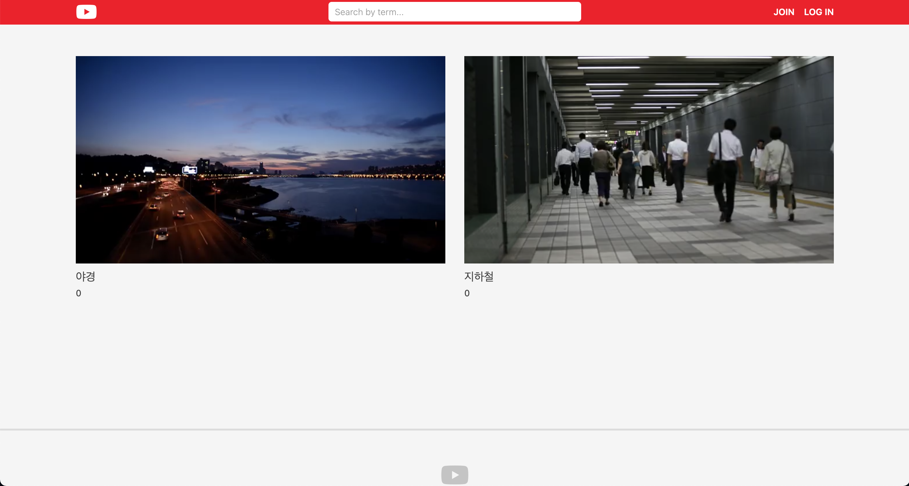

# Wetube

Cloning Youtube with Vanilla JS and NodeJS  
❗️PC 사용을 권장합니다

## Preview

 

👉 [사이트 방문하기](https://blooming-dusk-92491.herokuapp.com/)

## File tree

<pre>
├── app.js
├── assets
│   ├── js
│   │   ├── addComment.js
│   │   ├── main.js
│   │   ├── videoPlayer.js
│   │   └── videoRecorder.js
│   └── scss
│       ├── config
│       │   ├── _variables.scss
│       │   ├── reset.scss
│       │   └── utils.scss
│       ├── main.scss
│       ├── pages
│       │   ├── home.scss
│       │   ├── userProfile.scss
│       │   └── videoDetail.scss
│       ├── partials
│       │   ├── footer.scss
│       │   ├── form.scss
│       │   ├── header.scss
│       │   ├── socialLogin.scss
│       │   ├── videoBlock.scss
│       │   ├── videoPlayer.scss
│       │   └── videoRecorder.scss
│       └── styles.scss
├── controllers
│   ├── userController.js
│   └── videoController.js
├── db.js
├── init.js
├── middlewares.js
├── models
│   ├── Comment.js
│   ├── User.js
│   └── Video.js
├── passport.js
├── preview.png
├── routers
│   ├── apiRouter.js
│   ├── globalRouter.js
│   ├── userRouter.js
│   └── videoRouter.js
├── routes.js
├── static
│   ├── main.css
│   └── main.js
├── views
│   ├── changePassword.pug
│   ├── deleteVideo.pug
│   ├── editProfile.pug
│   ├── editVideo.pug
│   ├── home.pug
│   ├── join.pug
│   ├── layouts
│   │   └── main.pug
│   ├── login.pug
│   ├── mixins
│   │   ├── videoBlock.pug
│   │   └── videoPlayer.pug
│   ├── partials
│   │   ├── footer.pug
│   │   ├── header.pug
│   │   └── socialLogin.pug
│   ├── search.pug
│   ├── upload.pug
│   ├── userDetail.pug
│   └── videoDetail.pug
└── webpack.config.js
</pre>

## Pages

- [x] Home
- [x] Log In
- [x] Join
- [x] Search
- [x] Change Password
- [x] Edit Profile
- [x] Edit Video
- [x] Upload
- [x] User Detail
- [x] Video Detail
- [ ] Recording Video

## Skills

- ES6
- Express Server
- Pug
- MongoDB (MongoDB cloud)
- AWS S3
- Webpack ES6 + SaSS
- heroku 배포

## Functions

- 로그인 & 로그아웃 (Social Login)
- 비디오 업로드 및 관리 (삭제, 수정)
- 비디오 검색 기능
- 댓글 기능
- 영상 녹화 기능 (업데이트중..)
